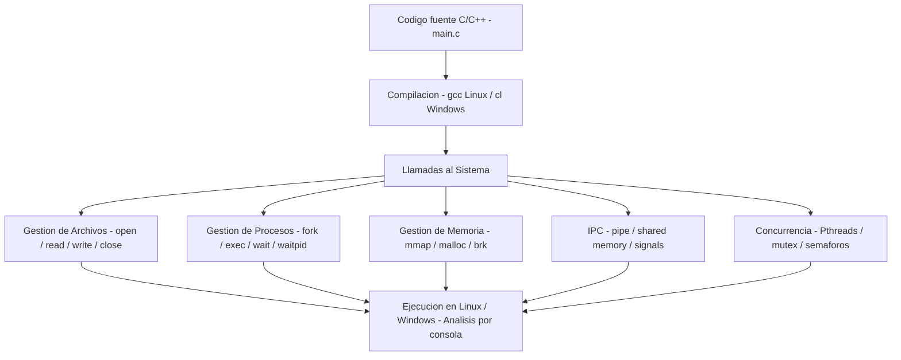

<div align="center">

# 📌 Sistemas Operativos - Proyecto con Llamadas al Sistema  

## 📖 Descripción

</div>

---

Este proyecto explora el uso de llamadas al sistema en entornos Linux y Windows para la gestión de procesos, archivos y memoria.

## 🛠️ Funcionalidades  
- Manipulación de archivos y directorios mediante llamadas al sistema.  
- Creación, ejecución y monitoreo de procesos.  
- Gestión de memoria y comunicación entre procesos (IPC).  
- Implementación de programación concurrente con hilos y procesos.  

## Arquitectura



## 🚀 Tecnologías utilizadas  
- C / C++  
- Bash / PowerShell  
- Linux / Windows  

## ▶️ Cómo ejecutar el proyecto  
1. Compilar los archivos fuente según el sistema operativo.  
   ```bash
   gcc main.c -o programa  # Linux
   cl main.c  # Windows (Visual Studio)
   ```
2. Ejecutar el programa y analizar la salida.  
3. Modificar los scripts según los requerimientos del sistema.  

## 📌 Autor  
👨‍💻 **Alejandro De Mendoza**

---

## Autor

**Alejandro De Mendoza**  
Ingeniero Informático · Especialista en IA · Especialista en Ingeniería de Software · Máster en Arquitectura de Software

[](https://github.com/AlejoTechEngineer)
